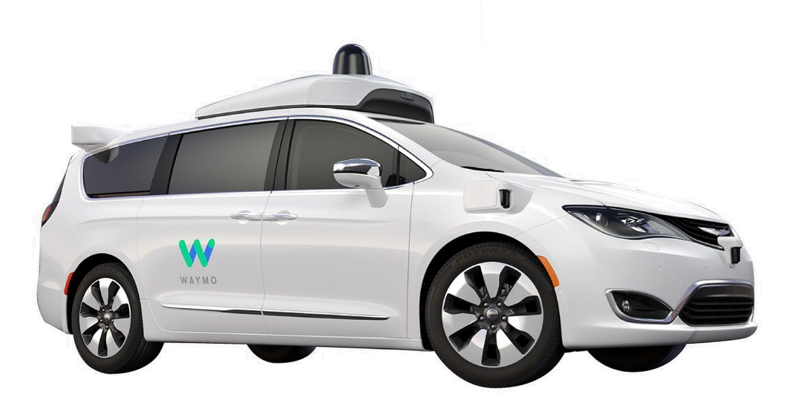

class: inverse, center, middle

# Perception? Autonomous Driving?

---
# Autonmous Systems

.pull-left[
.center[]
.center[Boston Dynamics - Spot]

<br/>
.center[]
.center[Waymo Self-Driving Car]
]

.pull-right[
.center[]
.center[DJI - Phantom 4]

<br/>
.center[]
.center[Naverlabs - M1]
]

---
# Three Blocks of Autonomous Systems

<br/>


---
# Three Blocks of Autonmous Systems

```c++
void main()
{
   // Initialization
   setup();
   
   // Infinite loop
   while(true)
   {
      // Step 1: perception
*     sense();
      
      // Step 2: planning
*     think();
      
      // Step 3: control
*     act();
   }
   
   // Finalization
   shutdown();
}
```
---
class: inverse, center, middle

# Sensors!

<!--
# Sensors for Self-Driving Cars

.center[]

.footnote[.small[https://www.robsonforensic.com/articles/autonomous-vehicles-sensors-expert/]]
-->

---
# Sensors for Self-Driving Cars

.center[]

.footnote[.small[[Autonomous Vehicles, Factsheets - Center for Sustainable Systems, University of Michigan ](http://css.umich.edu/sites/default/files/Autonomous%20Vehicles_CSS16-18_e2019.pdf)]]

---
# Sensors for Self-Driving Cars

.center[]

.footnote[
.small[
https://www.ansys.com/about-ansys/advantage-magazine/volume-xii-issue-1-2018/autonomous-vehicle-radar
]
]

---
# LIDAR (LIght Detection And Ranging)

.pull-left[
.center[]
.center[Velodyne Lidar - Alpha Prime<sup>[1]</sup>]

.xx-small[<br/>]
Pros
- Generates point clouds
- Accurate point positions
- Works well even at night
]
.pull-right[
.center[<iframe width="560" height="200" src="https://www.youtube.com/embed/tZ8WbSNsNaU?start=5&end=137&mute=1&autoplay=1" frameborder="0" allow="accelerometer; autoplay; encrypted-media; gyroscope; picture-in-picture" allowfullscreen></iframe>]
.center[Velodyne Lidar - Alpha Prime<sup>[2]</sup>]

.xx-small[<br/>]
Cons
- Very expensive
- Sparse points
- Issues in fog, rain and snow
]

.footnote[
.small[
1. https://velodynelidar.com/products/alpha-prime/  
2. https://www.youtube.com/watch?v=tZ8WbSNsNaU
]
]

---
# RADAR (RAdio Detection And Ranging)

.pull-left[
.center[]
.center[Aptive - ESR 2.5<sup>[1]</sup>]

.xx-small[<br/>]
Pros
- Long operating distance
- Effective for relative speeds
- Works in fog, rain, snow, night
]
.pull-right[
.center[<iframe width="560" height="200" src="https://www.youtube.com/embed/6oL19umG-Ao?start=20&end=70&mute=1&autoplay=1" frameborder="0" allow="accelerometer; autoplay; encrypted-media; gyroscope; picture-in-picture" allowfullscreen></iframe>]
.center[Texas Insrument - AWR1642<sup>[2]</sup>]

.xx-small[<br/>]
Cons
- Low resolution
- Very sparse
- Noisy and less accurate
]

.footnote[
.small[
1. https://autonomoustuff.com/product/aptiv-esr-2-5-24v/
2. https://www.youtube.com/watch?v=ziQjbVXcSts
]
]

---
# Camera

.pull-left[
.center[]
.center[Continental - SVC210<sup>[1]</sup>]

.xx-small[<br/>]
Pros
- Rich texture information
- Very affordable
]
.pull-right[
.center[<iframe width="560" height="200" src="https://www.youtube.com/embed/KXpZ6B1YB_k?start=5&end=30&mute=1&autoplay=1" frameborder="0" allow="accelerometer; autoplay; encrypted-media; gyroscope; picture-in-picture" allowfullscreen></iframe>]
.center[KITTI Vision Dataset<sup>[2]</sup>]

.xx-small[<br/>]
Cons
- No depth information
- Issues in sun glare and shadow
]

.footnote[
.small[
1. https://www.continental-automotive.com/en-gl/2-Wheeler/Safe-Mobility/Sensors/Surround-View-Camera-SVC210
2. https://www.youtube.com/watch?v=KXpZ6B1YB_k
]
]

---
# LIDAR vs. Camera

.center[<iframe width="560" height="315" src="https://www.youtube.com/embed/y3Q7v5a0lnI?start=8&end=560&mute=1&autoplay=1&loop=1&playlist=B8R148hFxPw&vq=hd1080" frameborder="0" allow="accelerometer; autoplay; encrypted-media; gyroscope; picture-in-picture" allowfullscreen></iframe>]
.center[Velodyne Lidar - Lidar vs Camera Comparison<sup>[1]</sup>]

.vspace-xx-large[.center[.x-large[Google vs. Tesla?]]]

.footnote[
.small[
1. https://www.youtube.com/watch?v=y3Q7v5a0lnI
]
]

---
# LIDAR vs. Camera

.center[<iframe width="560" height="315" src="https://www.youtube.com/embed/B8R148hFxPw?start=38&end=66&mute=1&autoplay=1&vq=hd1080" frameborder="0" allow="accelerometer; autoplay; encrypted-media; gyroscope; picture-in-picture" allowfullscreen></iframe>]
.center[Waymo Self-Driving Car<sup>[1]</sup>]

.vspace-xx-large[.center[.x-large[We Need Sensor Fusion!]]]

.footnote[
.small[
1. https://www.youtube.com/watch?v=B8R148hFxPw
]
]

---
# Camera-RADAR Sensor Fusion

.center[<iframe width="560" height="315" src="https://www.youtube.com/embed/cMlGyIJH5L8?start=13&end=89&mute=1&autoplay=1&vq=hd1080" frameborder="0" allow="accelerometer; autoplay; encrypted-media; gyroscope; picture-in-picture" allowfullscreen></iframe>]
.center[NVIDIA (6 Cameras and 8 RADARs) <sup>[1,2]</sup>]

.vspace-xx-large[.center[.x-large[Detection + Position, Velocity and Acceleration]]]

.footnote[
.small[
1. https://www.youtube.com/watch?v=cMlGyIJH5L8
2. https://developer.nvidia.com/blog/autonomous-vehicle-radar-perception-in-360-degrees/
]
]

---
# LIDAR-Camera Sensor Fusion

.center[<iframe width="560" height="315" src="https://www.youtube.com/embed/XzLE-RW9wv8?mute=1&autoplay=1&loop=1&playlist=XzLE-RW9wv8&vq=hd1080" frameborder="0" allow="accelerometer; autoplay; encrypted-media; gyroscope; picture-in-picture" allowfullscreen></iframe>]
.center[LIDAR-CAMERA Fusion <sup>[1]</sup>]

.footnote[
.small[
1. https://www.youtube.com/watch?v=XzLE-RW9wv8
]
]


---
# GNSS and IMU

.pull-left[
#### Global Navigation Satellite  System

.center[]
.center[NovAtel - GPS-704-X<sup>[1]</sup>]

<br/>
[+] Global position, all weather

[-] Issues in downtown
]

.pull-right[
#### Inertial Measurement Unit
.center[]
.center[Xsens - MTi-100<sup>[1]</sup>]


<br/>
[+] Egomotion, cheap, all weather

[-] Very noisy, bias
]

.footnote[
.small[
1. https://novatel.com/products/antennas/high-performance-gnss-gps-antennas/gps-704-x
2. https://www.xsens.com/products/mti-100-series
]
]

---
# Other Sensors

## - Odometry sensors
## - Ultrasonic sensors
## - Thermal cameras
## - Solid-State LIDAR

---
class: inverse, center, middle

# Perception for Autonomous Driving!

---
# Perception for Autonomous Driving

## 1. Localization
## 2. Detection
## 3. Tracking
## 4. Estimation
## 5. Prediction

---
class: inverse, center, middle

# 1. Localization

---
# HD Maps

.center[<iframe width="560" height="315" src="https://www.youtube.com/embed/ga5fW-QSXp0?start=58&end=150&mute=1&autoplay=1&vq=hd1080" frameborder="0" allow="accelerometer; autoplay; encrypted-media; gyroscope; picture-in-picture" allowfullscreen></iframe>]
.center[TomTom - HD Maps<sup>[1]</sup>]

- SLAM using sesor fusion (LIDAR, camera, RADAR, GNSS, IMU, odometry)
- Lanes, center lines, road boundaries, intersections 
- Traffic signs, traffic lights, poles, road markings

.footnote[
.small[
1. https://www.youtube.com/watch?v=ga5fW-QSXp0
]
]

---
# GNSS+INS vs. HD-map Based Localization

.center[<iframe width="560" height="315" src="https://www.youtube.com/embed/PIf5fh2-3z4?mute=1&autoplay=1&loop=1&playlist=PIf5fh2-3z4&vq=hd1080" frameborder="0" allow="accelerometer; autoplay; encrypted-media; gyroscope; picture-in-picture" allowfullscreen></iframe>]
.center[Naver Labs - HD Map Based Localization<sup>[1]</sup>]

.footnote[
.small[
1. https://www.youtube.com/watch?v=PIf5fh2-3z4
2. https://www.youtube.com/watch?v=s0GK2EBpGZ8
]
]

---
# Localization using Cameras

.center[<iframe width="560" height="315" src="https://www.youtube.com/embed/jcKnb65wpWA?start=13&end=86&mute=1&autoplay=1&vq=hd1080" frameborder="0" allow="accelerometer; autoplay; encrypted-media; gyroscope; picture-in-picture" allowfullscreen></iframe>]
.center[NVIDIA using cameras<sup>[1]</sup>]

- .green[Ego lane lines], .magenta[center of ego lane], .blue[road boundaries]
- .gold[Intersection lines, poles, traffic signs, traffic lights]

.footnote[
.small[
1. https://www.youtube.com/watch?v=jcKnb65wpWA
2. https://www.youtube.com/watch?v=5IydCAYB5N0&t=20s
]
]

---
# Localization using Sensor Fusion

.center[<iframe width="560" height="315" src="https://www.youtube.com/embed/jcKnb65wpWA?start=87&end=115&mute=1&autoplay=1&vq=hd1080" frameborder="0" allow="accelerometer; autoplay; encrypted-media; gyroscope; picture-in-picture" allowfullscreen></iframe>]
.center[NVIDIA - Localization using camera, lidar, and radar layers<sup>[1]</sup>]

.footnote[
.small[
1. https://www.youtube.com/watch?v=jcKnb65wpWA
]
]

---
class: inverse, center, middle

# 2. Detection

---
# Lane Detection

.center[<iframe width="560" height="315" src="https://www.youtube.com/embed/IzvlqCEYjg4?start=15&end=79&mute=1&autoplay=1&vq=hd1080" frameborder="0" allow="accelerometer; autoplay; encrypted-media; gyroscope; picture-in-picture" allowfullscreen></iframe>]
.center[NVIDIA - LaneNet<sup>[1]</sup>]

- .red[Solid lane lines], .blue[dashed lane lines]

.footnote[
.small[
1. https://www.youtube.com/watch?v=IzvlqCEYjg4
]
]

---
# Object Detection

.center[<iframe width="560" height="315" src="https://www.youtube.com/embed/Vu8gmFhiGko?&mute=1&autoplay=1&vq=hd1080" frameborder="0" allow="accelerometer; autoplay; encrypted-media; gyroscope; picture-in-picture" allowfullscreen></iframe>]
.center[Waymo Self-driving Car at a Crowded School Crossing<sup>[1]</sup>]

- .magenta[Cars (back)], .green[cars (front)]
- .gold[Pedestrians]
- .gray[Traffic signs]

.footnote[
.small[
1. https://www.youtube.com/watch?v=Vu8gmFhiGko
]
]

---
# Object Detection

.center[<iframe width="560" height="315" src="https://www.youtube.com/embed/OopTOjnD3qY?mute=1&autoplay=1&loop=1&playlist=OopTOjnD3qY&vq=hd1080" frameborder="0" allow="accelerometer; autoplay; encrypted-media; gyroscope; picture-in-picture" allowfullscreen></iframe>]
.center[Waymo Self-driving Car Navigates a Police Controlled Intersection<sup>[1]</sup>]

- .magenta[Cars]
- .gold[Pedestrians]
- .orange[Traffic cones], .red[intersections]

.footnote[
.small[
1. https://www.youtube.com/watch?v=Vu8gmFhiGko
]
]

---
# Map Feature Detection

.center[<iframe width="560" height="315" src="https://www.youtube.com/embed/dl8MI4vZmUY?start=16&end=68&mute=1&autoplay=1&&vq=hd1080" frameborder="0" allow="accelerometer; autoplay; encrypted-media; gyroscope; picture-in-picture" allowfullscreen></iframe>]
.center[NVIDIA - MapNet<sup>[1]</sup>]

- Lanes: .gray[Road boundaries], .blue[dashed lines], .red[solid lines]
- Intersections: .orange[Intersections], .magenta[cross-traffic intersections]
- Others: .gold[Poles], .cyan[road markings]

.footnote[
.small[
1. https://www.youtube.com/watch?v=dl8MI4vZmUY
]
]

---
# Traffic Sign and Traffic Light Detection

.center[<iframe width="560" height="315" src="https://www.youtube.com/embed/Uz5mIdRtdeA?start=13&end=80&mute=1&autoplay=1&&vq=hd1080" frameborder="0" allow="accelerometer; autoplay; encrypted-media; gyroscope; picture-in-picture" allowfullscreen></iframe>]
.center[NVIDIA - WaitNet, LightNet, SignNet<sup>[1]</sup>]

- WaitNet: .gold[intersections]
- SignNet: .blue[traffic signs]
- LightNet: .red[red light], .green[green light]


.footnote[
.small[
1. https://www.youtube.com/watch?v=Uz5mIdRtdeA
]
]

---
# Intersection Detection

.center[<iframe width="560" height="315" src="https://www.youtube.com/embed/KPLTA4S_3Yo?start=26&end=88&mute=1&autoplay=1&loop=1&playlist=KPLTA4S_3Yo&vq=hd1080" frameborder="0" allow="accelerometer; autoplay; encrypted-media; gyroscope; picture-in-picture" allowfullscreen></iframe>]
.center[NVIDIA - Intersection Detection<sup>[1]</sup>]

.vspace-xx-large[.center[.x-large[Where to stop and exit?]]]

.footnote[
.small[
1. https://www.youtube.com/watch?v=KPLTA4S_3Yo
]
]

---
# Parking Space Detection

.center[<iframe width="560" height="315" src="https://www.youtube.com/embed/Bzfmc-PDwtM?start=10&end=70&mute=1&autoplay=1&vq=hd1080" frameborder="0" allow="accelerometer; autoplay; encrypted-media; gyroscope; picture-in-picture" allowfullscreen></iframe>]
.center[NVIDIA - ParkNet<sup>[1]</sup>]

.vspace-xx-large[.center[.x-large[Where to park? &nbsp; How to enter?]]]

- .red[Parking lines], .green[entry lines]

.footnote[
.small[
1. https://www.youtube.com/watch?v=Bzfmc-PDwtM
]
]

---
class: inverse, center, middle

# 3. Tracking

---
# Feature Tracking

.center[<iframe width="560" height="315" src="https://www.youtube.com/embed/y2X_7KwppoI?start=10&end=69&mute=1&autoplay=1&vq=hd1080" frameborder="0" allow="accelerometer; autoplay; encrypted-media; gyroscope; picture-in-picture" allowfullscreen></iframe>]
.center[NVIDIA - Feature Tracking<sup>[1]</sup>]

- Tracked features: .blue[features], .cyan[feature track histories]
- Detected Objects: .green[moving away], .gold[getting closer], .red[urgent]

.footnote[
.small[
1. https://www.youtube.com/watch?v=y2X_7KwppoI
]
]

---
# Object Tracking

.center[<iframe width="560" height="315" src="https://www.youtube.com/embed/aQwqD5cB2ck?start=17&end=71&mute=1&autoplay=1&vq=hd1080" frameborder="0" allow="accelerometer; autoplay; encrypted-media; gyroscope; picture-in-picture" allowfullscreen></iframe>]
.center[NVIDIA -Surround Camera Object Tracking<sup>[1]</sup>]

.footnote[
.small[
1. https://www.youtube.com/watch?v=aQwqD5cB2ck
]
]

---
# Pixel-level Object Detection and Tracking

.center[<iframe width="560" height="315" src="https://www.youtube.com/embed/HS1wV9NMLr8?start=16&end=65&mute=1&autoplay=1&vq=hd1080" frameborder="0" allow="accelerometer; autoplay; encrypted-media; gyroscope; picture-in-picture" allowfullscreen></iframe>]
.center[NVIDIA - Pixel-Perfect Perception<sup>[1]</sup>]

- Detection (top): .blue[Cars], .red[Pedestrians], .green[Drivable space]
- Tracking (bottom): object id (unique numbers and colors)

.footnote[
.small[
1. https://www.youtube.com/watch?v=HS1wV9NMLr8
]
]

---
class: inverse, center, middle

# 4. Estimation

---
# Depth Estimation from Single Camera

.center[<iframe width="560" height="315" src="https://www.youtube.com/embed/ftsUg5VlzIE?start=13&end=47&mute=1&autoplay=1&vq=hd1080" frameborder="0" allow="accelerometer; autoplay; encrypted-media; gyroscope; picture-in-picture" allowfullscreen></iframe>]
.center[NVIDIA - Depth Estimation from Single Camera<sup>[1]</sup>]

- .green[Cars]
- .cyan[Pedestrians]

.footnote[
.small[
1. https://www.youtube.com/watch?v=ftsUg5VlzIE
]
]

---
class: inverse, center, middle

# 5. Prediction

---
# Car Trajectories

.center[<iframe width="560" height="315" src="https://www.youtube.com/embed/yEtH23rKY8Q?start=54&end=174&mute=1&autoplay=1&loop=1&playlist=yEtH23rKY8Q&vq=hd1080" frameborder="0" allow="accelerometer; autoplay; encrypted-media; gyroscope; picture-in-picture" allowfullscreen></iframe>]
.center[NVIDIA - Predicting moving objects using camera and radar<sup>[1]</sup>]

.footnote[
.small[
1. https://www.youtube.com/watch?v=NG_O4RyQqGE
]
]

---
# Pedestrian Trajectories

.center[<iframe width="560" height="315" src="https://www.youtube.com/embed/NG_O4RyQqGE?mute=1&autoplay=1&loop=1&playlist=NG_O4RyQqGE&vq=hd1080" frameborder="0" allow="accelerometer; autoplay; encrypted-media; gyroscope; picture-in-picture" allowfullscreen></iframe>]
.center[Waymo Self-driving Car Allowing Cyclists to Pass<sup>[1]</sup>]

.footnote[
.small[
1. https://www.youtube.com/watch?v=NG_O4RyQqGE
]
]

---
class: inverse, center, middle

# Summary

---
# Perception for Autonomous Driving
.pull-left-40[
.xx-large[
- Three Blocks
.x-large[
1. Perception
2. Planning
3. Control
] 
<br/>
- Sensors
.x-large[
1. LIDAR
2. RADAR
3. Camera
4. GNSS, IMU
5. Sensor Fusion
]
]
]

.pull-right-60[
.xx-large[
- Perception
.x-large[
1. Localization: HD Maps
2. Detection: objects
3. Tracking: feature/object
4. Estimation: depth
5. Prediction: object trajectories
]
]
]

---

class: inverse, center, middle

# Thanks!

